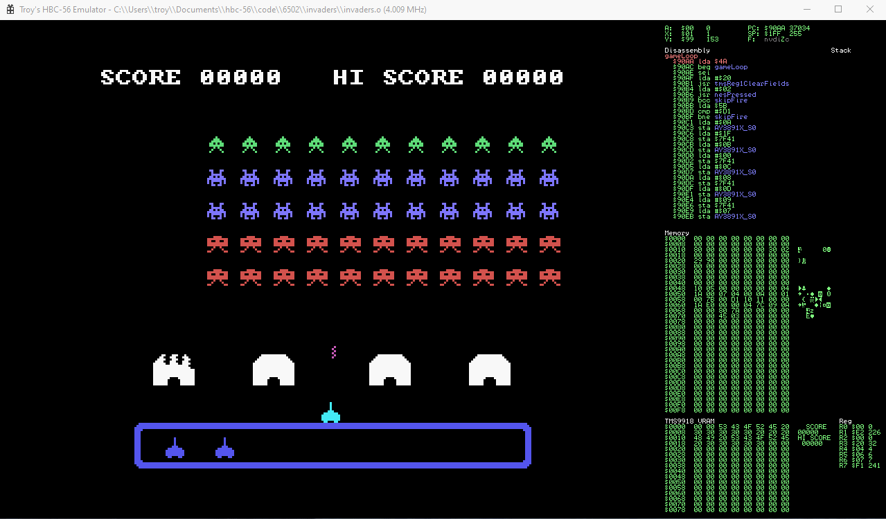
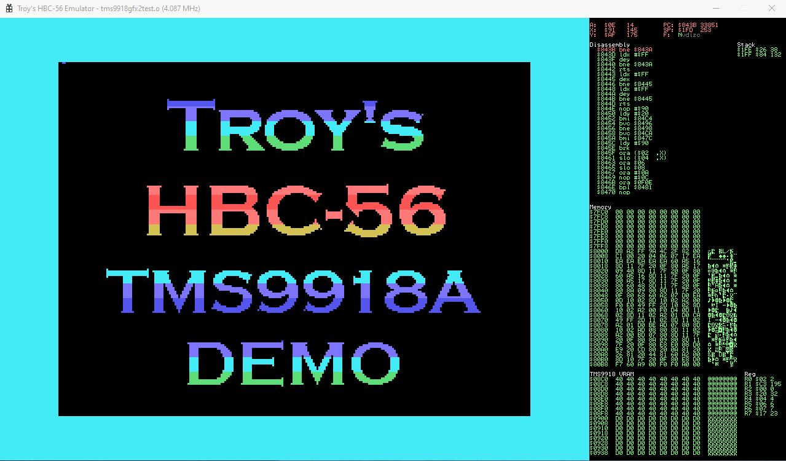
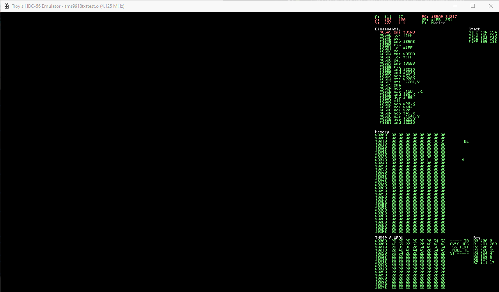
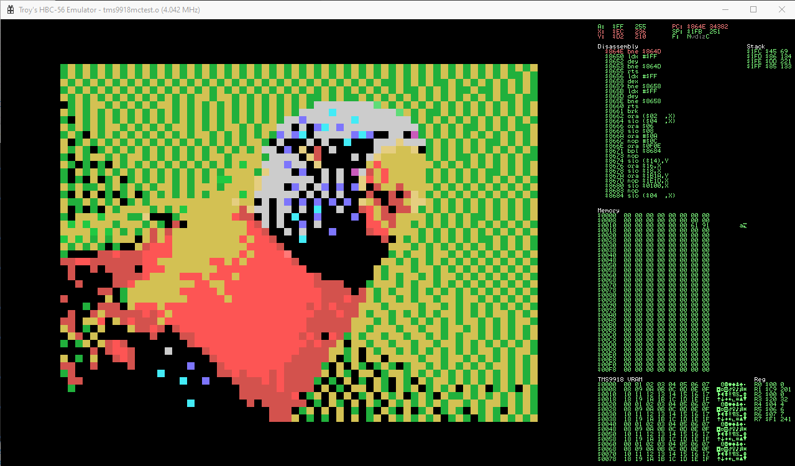

# vrEmuTms9918 - TMS9918/TMS9918A/TMS9928A/TMS9929A VDP Emulator

TMS9918 emulator. Core engine written in C99. Zero dependencies.

The goal is to emulate all documented modes listed in the [TMS9918A/TMS9928A/TMS9929A datasheet](http://www1.cs.columbia.edu/~sedwards/papers/TMS9918.pdf)

## Supported Modes

* Graphics I (including sprites)
* Graphics II (including sprites)
* Multicolor mode (including sprites)
* Text

## Other features

* 5th sprite
* Sprite collisions
* VSYNC interrupt
* Individual scanline rendering

## Screenshots:

#### Graphics Mode I Demo


#### Graphics Mode II Demo


#### Text Mode Demo


#### Multicolor Mode Demo



## Quick start

```c
#include "tms9918_core.h"

#define TMS_R1_RAM_16K         0x80

#define TMS_VRAM_NAME_ADDRESS          0x3800
#define TMS_VRAM_COLOR_ADDRESS         0x0000
#define TMS_VRAM_PATT_ADDRESS          0x2000
#define TMS_VRAM_SPRITE_ATTR_ADDRESS   0x3B00
#define TMS_VRAM_SPRITE_PATT_ADDRESS   0x1800

VrEmuTms9918a *tms9918 = NULL;

// write a tms9918 register value
void writeTmsRegisterValue(uint8_t reg, uint8_t value)
{
  vrEmuTms9918aWriteAddr(tms9918, value);
  vrEmuTms9918aWriteAddr(tms9918, 0x80 | reg);
}

// set the current read address
void setTmsAddressRead(uint16_t addr)
{
  vrEmuTms9918aWriteAddr(tms9918, addr & 0x00ff);
  vrEmuTms9918aWriteAddr(tms9918, ((addr & 0xff00) >> 8));
}

// set the current write address
void setTmsAddressWrite(uint16_t addr)
{
  setTmsAddressRead(addr | 0x4000);
}


/* tms9918 palette */
const uint32_t tms9918Pal[] = {
  0x00000000, /* transparent */
  0x000000ff, /* black */
  0x21c942ff, /* medium green */
  0x5edc78ff, /* light green */
  0x5455edff, /* dark blue */
  0x7d75fcff, /* light blue */
  0xd3524dff, /* dark red */
  0x43ebf6ff, /* cyan */
  0xfd5554ff, /* medium red */
  0xff7978ff, /* light red */
  0xd3c153ff, /* dark yellow */
  0xe5ce80ff, /* light yellow */
  0x21b03cff, /* dark green */
  0xc95bbaff, /* magenta */
  0xccccccff, /* grey */
  0xffffffff  /* white */
};

// program entry point
int main()
{
  // create a new tms9918
  tms9918 = vrEmuTms9918aNew();
  
  // set up the registers
  writeTmsRegisterValue(0, 0);
  writeTmsRegisterValue(1, TMS_R1_RAM_16K);
  writeTmsRegisterValue(2, TMS_VRAM_NAME_ADDRESS >> 10);
  writeTmsRegisterValue(3, TMS_VRAM_COLOR_ADDRESS >> 6);
  writeTmsRegisterValue(4, TMS_VRAM_PATT_ADDRESS >> 11);
  writeTmsRegisterValue(5, TMS_VRAM_SPRITE_ATTR_ADDRESS >> 7);
  writeTmsRegisterValue(6, TMS_VRAM_SPRITE_PATT_ADDRESS >> 11);
  writeTmsRegisterValue(7, TMS_BLACK << 4 | TMS_CYAN);
  
  // send it some data (a pattern)
  setTmsAddressWrite(TMS_VRAM_PATT_ADDRESS);
  
  char smile[] = { 0x3C, 0x42, 0x81, 0xA5, 0x81, 0x99, 0x42, 0x3C };
  for (int i = 0; i < sizeof(smile); ++i)
  {
    vrEmuTms9918aWriteData(tms9918, smile[i]);
  } 

  // send a byte to the name table
  setTmsAddressWrite(TMS_VRAM_NAME_ADDRESS);

  // a few smiles
  vrEmuTms9918aWriteData(tms9918, 0x00);
  vrEmuTms9918aWriteData(tms9918, 0x00);
  vrEmuTms9918aWriteData(tms9918, 0x00);
  
  char scanline[TMS9918A_PIXELS_X]; // scanline buffer
  
  uint32_t frameBuffer[TMS9918A_PIXELS_X * TMS9918A_PIXELS_Y]; // framebuffer (for SDL texture)

  // render the display
  uint32_t *pixPtr = frameBuffer;
  for (int y = 0; y < TMS9918A_PIXELS_Y; ++y)
  {
    // get the scanline pixels
    vrEmuTms9918aScanLine(tms9918, y, scanline);
    
    // here, you can do whatever you like with the pixel data
    // eg. render to an SDL texture/framebuffer...
    for (int x = 0; x < TMS9918A_PIXELS_X; ++x)
    {
      *pixPtr++ = tms9918Pal[scanline[x]];
    }    
  }
  
  // output the buffer...
  
  vrEmuTms9918aDestroy(tms9918);
  tms9918 = NULL;
  
  return 0;
}
```

## License
This code is licensed under the [MIT](https://opensource.org/licenses/MIT "MIT") license
